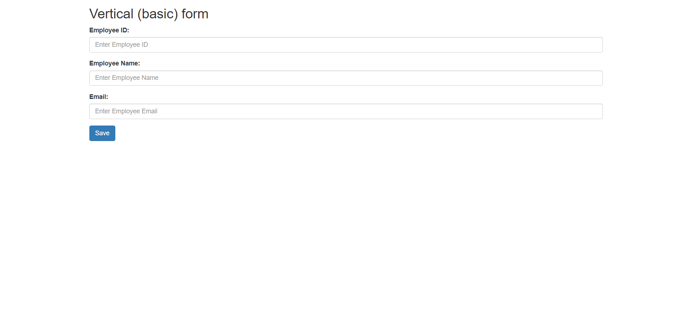
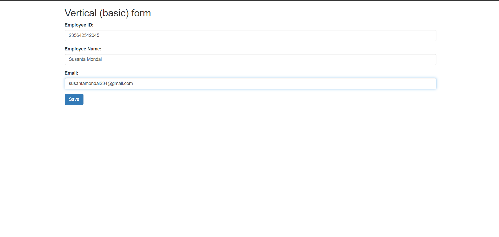
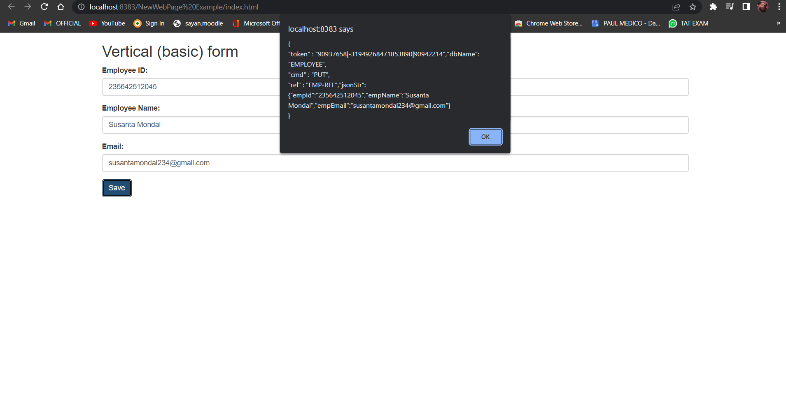
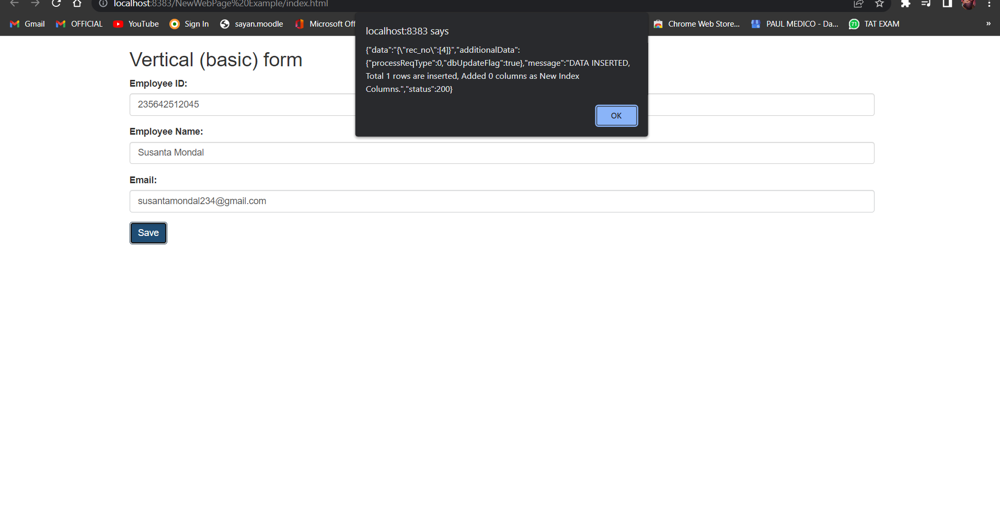

# JS_DB-SIMPLE-PROJECT
## Basic vertical form for Employee.
### You can fork it. But before that, please give a star (It's totally free).

[Documentation Link](http://login2e](https://github.com/Shuvadeep002/JS_DB-SIMPLE-PROJECT)xplore.com/jpdb/docs.html)

## You can

## "This project is created for puting records of a employee in the jsonPower batabase." 
### If you want to make changes in this repo, then create a PR. I will be happy to add more into it. Thanks.!
### About JsonPowerDB:

- JsonPowerDB is a Real-time, High Performance, Lightweight and Simple to Use, Rest API based Multi-mode DBMS. JsonPowerDB has ready to use API for Json document DB, RDBMS, Key-value DB, GeoSpatial DB and Time Series DB functionality. JPDB supports and advocates for true serverless and pluggable API development.

### Benefits of using JsonPowerDB

- Simplest way to retrieve data in a JSON format.
- Schema-free, Simple to use, Nimble and In-Memory database.
- It is built on top of one of the fastest and real-time data indexing engine - PowerIndeX.
- It is low level (raw) form of data and is also human readable.
- It helps developers in faster coding, in-turn reduces development cost.

### Screenshots:

)

